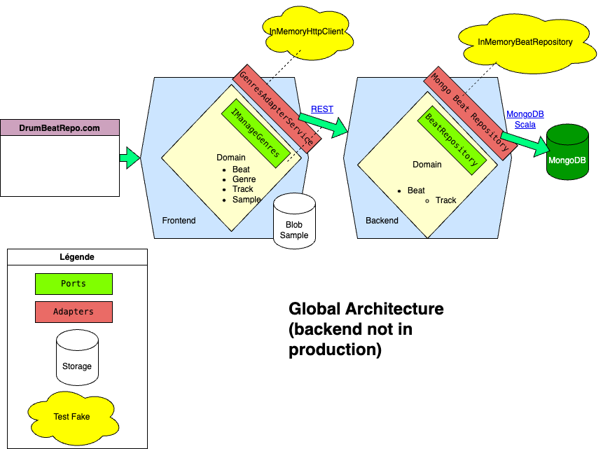

# 🥁 Drum Beat Repository 🥁

## Description
### A rhythm library for playing drum beats in the browser !

Welcome to **Drum Beat Repository**, a project built to help musicians, producers, and developers work with drum patterns.
This library leverages **Angular** and the **Web Audio API** to deliver a smooth, interactive drum sequencing experience right in your browser.

## Features

- [x] **Browse Beats**: Explore a variety of pre-organized drum patterns.
- [x] **Play and Listen**: Play back drum beats with precise audio timing using the Web Audio API.
- [x] **Interactive Sequencer**: Visualize beats in the sequencer and follow the pattern as it plays.
- [ ] **Create your own beats**: Create sequence in the browser ...
- [ ] **Store beats in the database**: ...and share it

## Architecture : main schema

## Linked readme

- [Frontend README](frontend/README.md)
- [Backend README](backend/README.md)

## How to Contribute

Contributions are welcome !

See the [CONTRIBUTING](CONTRIBUTING.md)

## Contributors

A big thanks to the project contributors!
- [Kireo](https://github.com/khg051203)
- [GiaHuy0031](https://github.com/GiaHuy0031)

## Contact

For questions, suggestions, or just to say hi, you can reach me via [email](mailto:bab07ali@gmail.com) or create an issue in the repository.

## License

- The code in this repository is licensed under the [GNU GENERAL PUBLIC LICENSE](LICENSE).
- All non-code content (such as ui concept and custom beat/rhythm) is licensed under a [Creative Commons Attribution-ShareAlike 4.0 International License](https://creativecommons.org/licenses/by-sa/4.0/).
