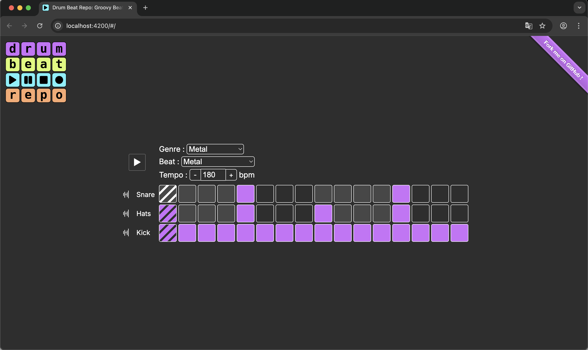

# 🥁 Drum Beat Repository

*A library of drum patterns for music lovers / Une bibliothèque rythmique pour les mélomanes 🎵*

Welcome to **Drum Beat Repository**, a web-based project for musicians to explore and create drum patterns. Built with **Angular** and the **Web Audio API**, this interactive tool delivers a smooth, in-browser drum sequencing experience.

👉 **Try it now:** [www.drumbeatrepo.com](https://www.drumbeatrepo.com/#/)

---

## 🤝 Contributing

### How to add your own beat ?

- Find a new genre or subgenre and verify it's not present yet
  - Either :
    - Add the name of the music genre/beat to the beggining of [issue](https://github.com/Babali42/DrumBeatRepo/issues/270) and I'll take care of it
    - Follow those steps in the bottom of [issue](https://github.com/Babali42/DrumBeatRepo/issues/270) and create a PR

### Thanks to the contributors
- **Kireo**
- **GiaHuy0031**  
  ...and everyone who's shared feedback and ideas ❤️

---

## 📄 License

- **Code**: Licensed under the [GNU General Public License](./LICENSE).  
- **Non-code content** (UI concepts, beats, etc.): Licensed under a [Creative Commons Attribution-ShareAlike 4.0](https://creativecommons.org/licenses/by-sa/4.0/) license.
