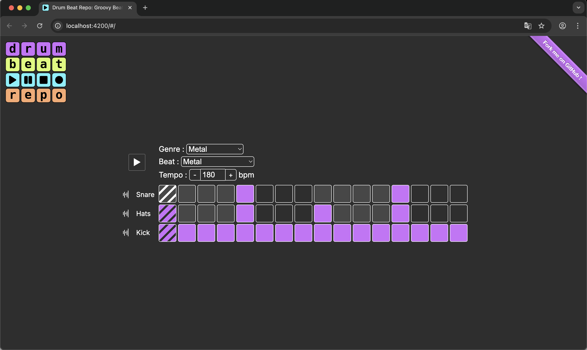

# 🥁 Drum Beat Repository

[](https://github.com/Babali42/DrumBeatRepo/actions/workflows/angular-deploy-github-pages.yml)
[](LICENSE)
[](https://github.com/Babali42/DrumBeatRepo/issues?q=is%3Aissue+is%3Aopen+label%3A%22good+first+issue%22)
[](https://github.com/Babali42/DrumBeatRepo/commits/main)
[](#contributors)

*A library of drum patterns for music lovers / Une bibliothèque rythmique pour les mélomanes 🎵*

Welcome to **Drum Beat Repository**, a web-based project for musicians to explore and create drum patterns. Built with **Angular** and the **Web Audio API**, this interactive tool delivers a smooth, in-browser drum sequencing experience.

👉 **Try it now:** [www.drumbeatrepo.com](https://www.drumbeatrepo.com/#/)



## Requirements

1. Scala Engine `./engine` : [Scala](https://www.scala-lang.org/) and its build tool [sbt](https://www.scala-sbt.org/)
2. Angular Application `./frontend`: [Node.js](https://nodejs.org/fr)


```bash
git clone https://github.com/Babali42/DrumBeatRepo.git

cd DrumBeatRepo/

cd engine/
sbt fastLinkJS

cd ../frontend/
npm run start
```

## 🚀 Quick Start

### 1. Engine (Scala)

#### Why ?

This scala engine is the core of the application, with the command/state modelling in a functional programming way.

> It's my first scala project, I'm open to feedbacks, and PR !

#### Go into directory

Open a terminal in folder : `cd engine/`

#### How to test it

- Run all tests : `sbt testFull`
- Continously run tests : `sbt "~test"`

#### How to link it to Angular

- Build a js file in the frontend project directory :
`sbt fastLinkJS`

### 2. Frontend (Angular)

#### Go into directory

Open a terminal in folder : `cd frontend/`

#### How to test it

- Run (angular) karma tests : `npm run test`
- Run vitest tests : `npm run test-vitest`

➡️ App runs at: `http://localhost:4200`

## Contributing

Everyone is welcome — devs, musicians, designers.

### 🔍 Find something to work on

* Browse issues: <https://github.com/Babali42/DrumBeatRepo/issues>
* Start with: `good first issue`

### 🥁 Add a drum beat

* Pick a missing genre
* Either:
    * Comment on <https://github.com/Babali42/DrumBeatRepo/issues/270>
    * Or implement it directly and open a PR

## Contribution Workflow

1. Fork + create branch from `main`
2. Make changes
3. ✅ Pass all tests
4. Open a Pull Request

## Contributors

<!-- ALL-CONTRIBUTORS-LIST:START - Do not remove or modify this section -->
<!-- prettier-ignore-start -->
<!-- markdownlint-disable -->
<table>
  <tbody>
    <tr>
      <td align="center" valign="top" width="14.28%"><a href="https://github.com/GiaHuy0031"><br /><sub><b>GiaHuy0031</b></sub></a><br /><a href="#code-GiaHuy0031" title="Code">💻</a></td>
      <td align="center" valign="top" width="14.28%"><a href="https://github.com/khg051203"><br /><sub><b>Kireo</b></sub></a><br /><a href="#code-khg051203" title="Code">💻</a></td>
      <td align="center" valign="top" width="14.28%"><a href="https://github.com/Konscept440"><br /><sub><b>Konscept440</b></sub></a><br /><a href="#audio-Konscept440" title="Audio">🔊</a> <a href="#design-Konscept440" title="Design">🎨</a> <a href="#example-Konscept440" title="Examples">💡</a></td>
      <td align="center" valign="top" width="14.28%"><a href="https://github.com/Linasti"><br /><sub><b>Linasti</b></sub></a><br /><a href="#ideas-Linasti" title="Ideas, Planning, & Feedback">🤔</a></td>
      <td align="center" valign="top" width="14.28%"><a href="https://github.com/jpeg729"><br /><sub><b>jpeg729</b></sub></a><br /><a href="#ideas-jpeg729" title="Ideas, Planning, & Feedback">🤔</a> <a href="#code-jpeg729" title="Code">💻</a></td>
      <td align="center" valign="top" width="14.28%"><a href="https://github.com/bLeclercDev"><br /><sub><b>bLeclercDev</b></sub></a><br /><a href="#code-bLeclercDev" title="Code">💻</a> <a href="#design-bLeclercDev" title="Design">🎨</a> <a href="#ideas-bLeclercDev" title="Ideas, Planning, & Feedback">🤔</a></td>
      <td align="center" valign="top" width="14.28%"><a href="https://github.com/PelinEnginDuran"><br /><sub><b>Pelin Engin Duran</b></sub></a><br /><a href="#code-PelinEnginDuran" title="Code">💻</a></td>
    </tr>
    <tr>
      <td align="center" valign="top" width="14.28%"><br /><sub><b>Slaiker</b></sub><br /><a href="#ideas-Slaiker" title="Ideas, Planning, & Feedback">🤔</a> <a href="#audio-Slaiker" title="Audio">🔊</a></td>
    </tr>
  </tbody>
</table>

<!-- markdownlint-restore -->
<!-- prettier-ignore-end -->

<!-- ALL-CONTRIBUTORS-LIST:END -->

- **Louison** for the ideation of the very first version of this app
- **Etienne** for the testing and the dub beat pattern
- **[Damien Musy](https://Damien-musy.fr)** for the blazing fast mobile ui sketch !

## License

- **Code**: Licensed under the [GNU General Public License](./LICENSE).  
- **Non-code content** (UI concepts, beats, etc.): Licensed under a [Creative Commons Attribution-ShareAlike 4.0](https://creativecommons.org/licenses/by-sa/4.0/) license.
