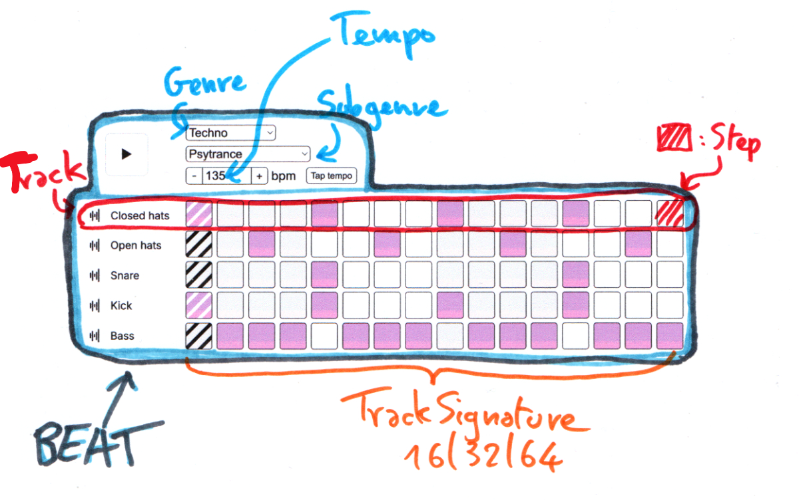

# Front-end

## 🛠️ Technologies

This project is built with:

- **Angular**: Modern, component-based front-end framework.
- **Web Audio API**: Direct access to audio capabilities of the browser for smooth sound manipulation and playback.

## Architecture

Hexagonal a.k.a. Port/Adapter


## Domain naming schema

The whole sequencer is represented in the domain layer



## 📚 References

<details>
  <summary>Misc. references used in this project</summary>

- https://rsms.me/inter/
- https://github.com/PahanPerera/angular-light-dark-app
- https://effect.website/
- https://github.com/simonwhitaker/github-fork-ribbon-css
- Host : https://pages.github.com/
- Sequencer : https://sebpiq.github.io/WAAClock/demos/beatSequence.html
</details>


## ⚙️ Local Setup

To run the project locally, follow these steps:

1. Clone this repository:

    ```bash
    git clone https://github.com/Babali42/drumbeatrepo.git
    cd drum-beat-repo/frontend
    ```

2. Install the dependencies:

    ```bash
    npm install
    ```

3. Start the development server:

    ```bash
    npm start
    ```

4. Visit `http://localhost:4200` in your browser to see the app in action.

## Run test locally

Run test :
```bash
npm run test
```

Watch test :
```bash
npm run ng test --watch
```

## Lint

Lint and show errors and warning
````
npx eslint
````

Lint and show only errors
````
npx eslint --quiet
````

## i18n

To test another language just use this in appcomponent.ts.

```typescript
this.translateService.use('xx');
```

with xx as **'fr'** or **'en'**
